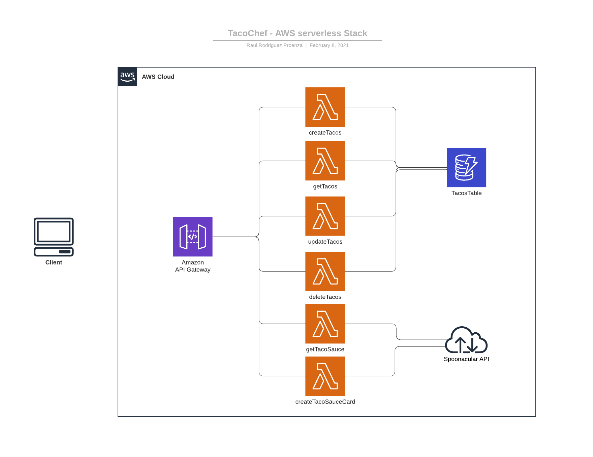
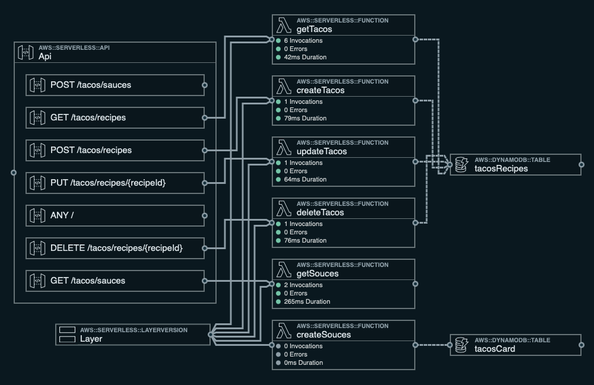

# taco-chef

> AWS Serverless Workshop

This is a serverless application to create a basic Restful service.

## Description

AWS serverless API project built using AWS SAM framework.

The stack is an orchestration of :

1. API Gateway
2. Lambda Functions
3. DynamoDB
4. Spoonacular.com API

## API Requirements

1. Consumers of the API should be able access full REST endpoints for the following actions:

    - Creating Taco recipes
    - Updating Taco recipes
    - Deleting Taco recipes
    - Retrieving a list of Taco recipes
    - Retrieve list of Taco sauces from Spoonacular.com Ingredient API
    - Post Taco Recipe to Spoonacular.com API and return Recipe Card image

2. Taco recipes consist of the following data:

    - Recipe Name
    - Recipe Description
    - Recipe Instructions
    - Ingredients:
        - Taco Shell
        - Taco Protein(s)
        - Taco Topping(s)
        - Taco Sauce(s)

3. The API should use some sort of mock DB and/or caching to persist the Taco recipe data

4. The API should contain at least one "positive" unit test and one "negative" unit test

## Solution Diagrams

### AWS Architecture Diagram

### SAM Template Architecture Diagram

> **Interesting**: Using Stackery.com as service/platform to deploy, monitor and control the application stack.

## How to Test

Use the `.rest` files placed on the `docs/restFulCalls/` directory to perform the API operations.

> For more details check the below demo

### Tests Demo

